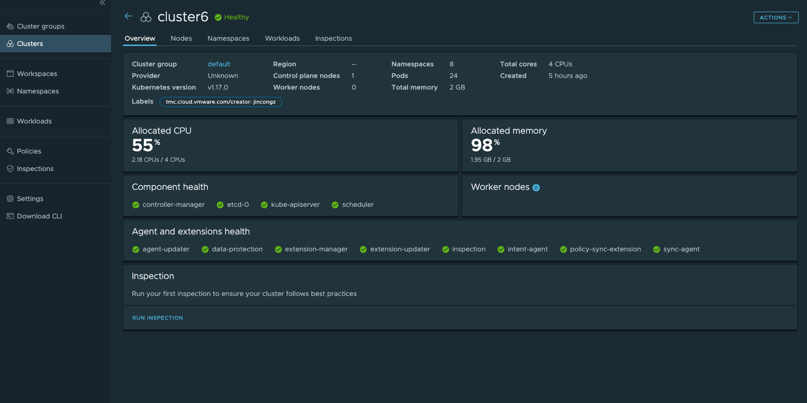
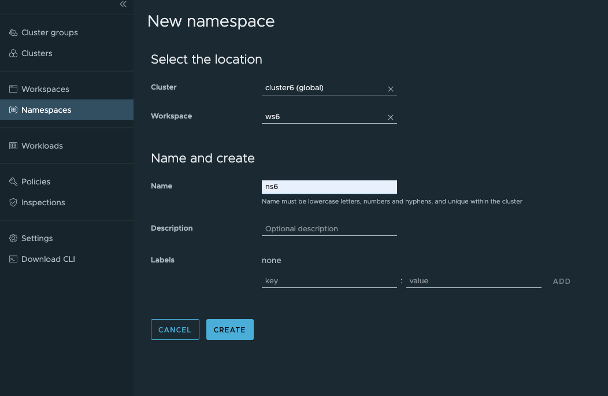
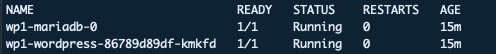
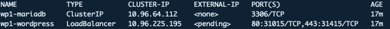
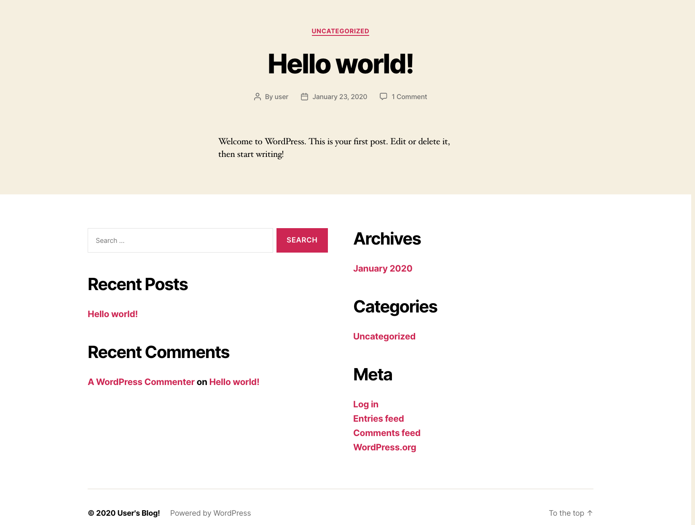
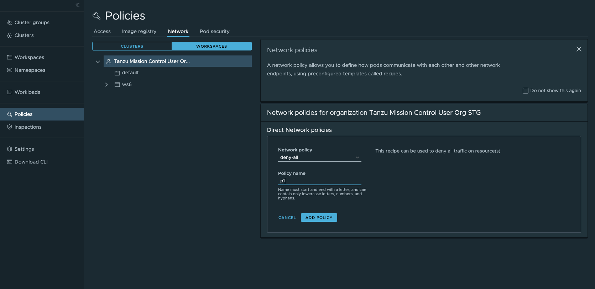
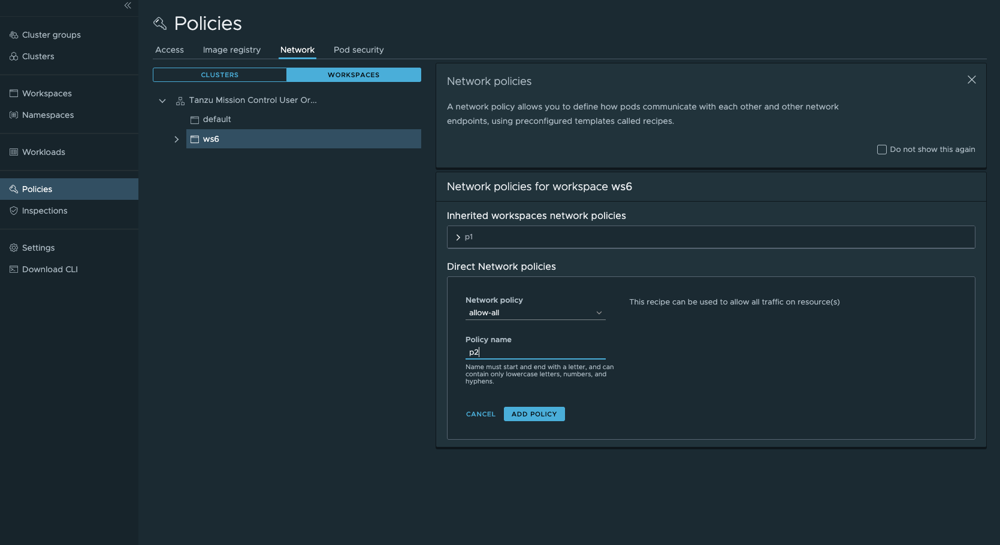

# Tanzu Mission Control - Network Policy Lab Guide

**Contents:**

- [Introduction](#introduction)
  - [Environment Pre-Requisites](#environment-pre-requisites)
- [Lab Exercises](#lab-exercises)
  - [Step 1: Lab Setup](#step-1-lab-setup)
  - [Step 2: Deploy Wordpress](#step-2-deploy-wordpress)
  - [Step 3: Apply and Examine Network Policy](#step-3-apply-and-examine-network-policy)
  - [Step 4: Clean up lab environment](#step-4-clean-up-lab-environment)
  - [Step 5: Validate Lab Guide](#step-5-validate-lab-guide)

## Introduction

Network Policy specifies how groups of pods are allowed to communicate with each other and other network endpoints, which is an important part of securing Kubernetes clusters. This document is intended to provide a guide to exploring basic usages of network policies in TMC. This demo script is validated on kind and provisioned clusters.

### Before Attempting This Lab:

This lab has a completion difficulty of `Partial`. Please see the rubrik below for an explanation of lab completion difficulty rankings

Lab Completion Difficulty Rankings: 

- Lab Completion Difficulty is not a measure of how complex or difficult a topic is, it is a measure of how thorough the instructions are in the provided lab guide:
- Difficulty Levels:
  - `Complete`
    - A lab guide with a difficulty of `Complete` includes comprehensive, click-by-click instructions, usually with a screenshot for every command entered. Complete labs must be associated with an online lab environment fully prepped to execute the exact instructions provided in the lab guide. Most users could successfully execute the steps in a `Complete` lab guide, even if they do not have expertise in the subject, by following detailed instructions.
  - `Partial`
    - A lab guide with a difficulty of `Partial` includes full instructions to complete the exercise, with enough detail to where a user with moderate experience in the subject matter could complete the exercise. `Partial` lab guides provide a level of detail similar to most typical technical documentation, where the user is expected to be able to configure their lab environment with dependencies required for the exercise, and to contextualize general instructions to the users own environment. 
  - `Challenge`
    - A lab guide with a difficulty of `Challenge` is designed to be technically challenging for the guide's target audience to complete. `Challenge` lab guides do not include comprehensive instructions, and intentionally leave out details required to complete exercises as a challenge or test of the users proficiency in a topic.

### Environment Pre-Requisites

The demo in this document is conducted with a development TMC stack in which a Kind cluster is attached:

<details><summary>Screenshot</summary>

</details>

## Lab Exercises

You will need to complete the steps in this section in your lab environment before attempting the remaining exercises in this lab guide/

### Step 1: Lab Setup

#### 1.1 Create a workspace and a namespace

In TMC UI, go to Workspaces→ New workspace to create a new workspace. In this example, a new workspace ws6 is created.

Click Workspaces and then click the workspace that is created in this step. In the page of the workspace, click New namespace to create a new namespace under the workspace. Please make sure to select the attached cluster, as shown in the screenshot. Namespace ns6 is created.

<details><summary>Screenshot</summary>

</details>

#### 1.2 Install a network plugin in the attached cluster

First we need to install a network plugin that is compatible with Kubernetes network policies. For example, we install Calico CNI by running the following command. The below step is not needed for provisioned clusters.

```bash
curl https://docs.projectcalico.org/v3.11/manifests/calico.yaml -O
kubectl apply -f calico.yaml
```

#### 1.3 Install Helm if it has not been installed (make sure to upgrade Helm even if is has been installed)

If you are using Mac OS you might simply run `brew install helm` to install Helm or `brew upgrade helm` to upgrade it (helm 3.0.2 is used in this demo script). For users of Linux/Windows, please follow [this guide](https://docs.bitnami.com/kubernetes/get-started-kubernetes/#step-4-install-helmr) to install Helm.

### Step 2: Deploy Wordpress

#### 2.1 Install Wordpress (with MariaDB) using Helm

Install Wordpress application by running the following command (it is named wp1 in this example).

```bash
helm repo add stable https://kubernetes-charts.storage.googleapis.com/
helm install wp1 stable/wordpress -n ns6 --set serviceType=NodePort
```

#### 2.2 Validate Installation

Make sure Wordpress' pods are ready by running the following command:

`kubectl get pods -n ns6`

The `READY` status should be similar to the screenshot below:

<details><summary>Screenshot</summary>

</details>

#### 2.3 Examine Network Service Configuration

Get the service details for wordpress services by running the command below:

`kubectl get svc -n ns6`

A Kind cluster does not support Loadbalancers currently (which is why the EXTERNAL-IP is <pending>) so in this example we will use kubectl port-forwarding to enable external access to the wordpress service.

Note that if you are using a different network service configuration to enable external access, such as node port, load balancer, or ingress,  you can use any preferred method to enable external access. If you have an alternative external IP configuration, you can use your external IP address rather than localhost and skip the following step to enable port-forwarding.

As shown in the screenshot below, there are two ports 80 and 443, which we can then use in port-forward:

<details><summary>Screenshot</summary>

</details>

#### 2.4 Use kubectl port-forward to enable external network access to wordpress

Enter the following command to enable port-forwarding to your wordpress service. Note that in the example command below, `wp1-wordpress` is the name of the wordpress service. If your wordpress service has a different name, be sure to update the command with the name of your wordpress service: 

`kubectl port-forward svc/wp1-wordpress 8080:443 -n ns`

#### 2.5 Access Wordpress UI

Access your Wordpress application webpage by visiting https://localhost:8080 in a browser. The browser might prompt a security warning and in this case click the option it provides to proceed. If you are using a different external network configuration, enter the address of your external IP rather than localhost. 

An example Wordpress application webpage is shown in the screenshot below.

<details><summary>Screenshot</summary>

</details>

### Step 3: Apply and Examine Network Policy

#### 3.1 Create Network Policy to deny traffic to your wordpress service

**CAUTION: This step implements a policy that will deny inbound traffic to all workspaces within the specified org. We strongly recommend against implementing this step on a kubernetes cluster that has any important services running, but if you do, ensure that there are no needed services running in the org you apply this policy to or inbound traffic to the services will be denied.**

In TMC UI, click Policies→ Network and then click WORKSPACES, select the org and click ADD NETWORK POLICY.

Add a new 'deny all' network policy to the workspace as shown in the screenshot below:

<details><summary>Screenshot</summary>

</details>

#### 3.2 Try to access wordpress UI with deny all network policy set

Try to access the Wordpress application webpage again (repeat chapter 3.1.2).

It should be unaccessible since the network policy deny all traffic on the resource(s).

#### 3.3 Create 'allow all' network policy in the workspace level

The previous step creates a 'deny all' network policy in the org level. In this step, we are going to create an an 'allow all' network policy in the workspace level to make an exception for this workspace which is to allow network traffic to this workspace. Follow most steps in chapter 3.2.1 but make sure to click the workspace and select 'allow all' when creating a new network policy the workspace.

<details><summary>Screenshot</summary>

</details>

#### 3.4 Try to access Wordpress webpage with allow all workspace level network policy set

Try to access the Wordpress application webpage again.

It should be accessible again since the network policy allow all traffic on the resource(s)

<details><summary>Screenshot</summary>

</details>

### Step 4: Clean up lab environment

#### 4.1  Delete the network policy by following these steps: click Policies in UI → Network → WORKSPACES →  click the workspace where the policy is set → click the policy and click delete

#### 4.2 Delete the installation of Wordpress by running the command below:

`helm uninstall wp1 -n ns6`

### Step 5: Validate Lab Guide

If you were able to complete this lab successfully without any significant problems, please sign the validate.md file located in this directory. 

If you encountered any problems, please open an issue ticket on this repository. 

If you have any updates or improvements for this lab guide, please open a PR with your updates.

### Thank you for completing the Tanzu Mission Control - Attaching Network Policy Lab Guide!
